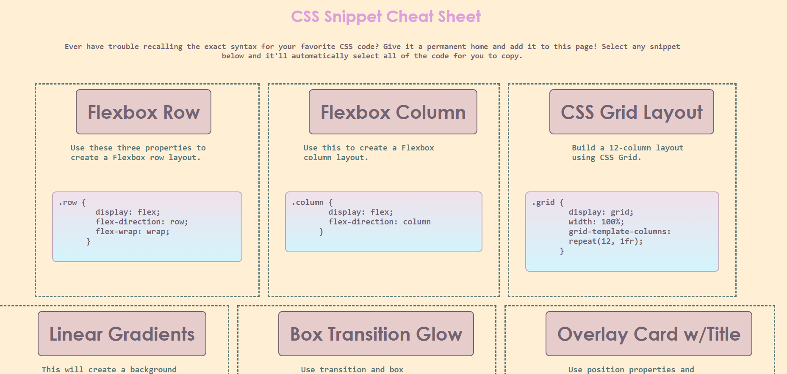
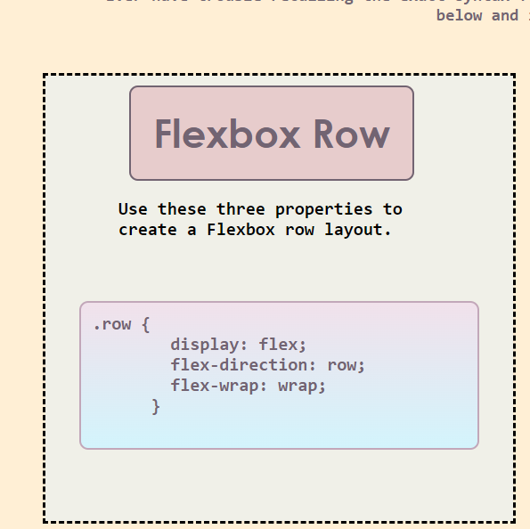
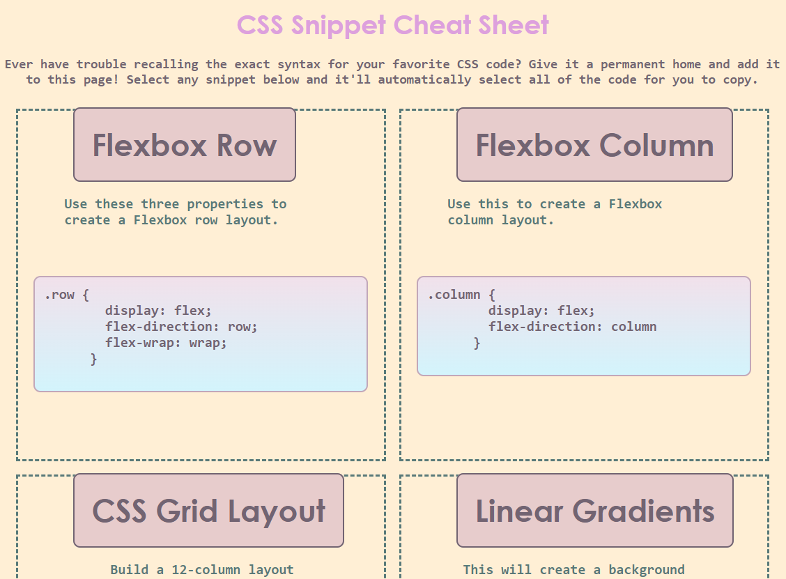
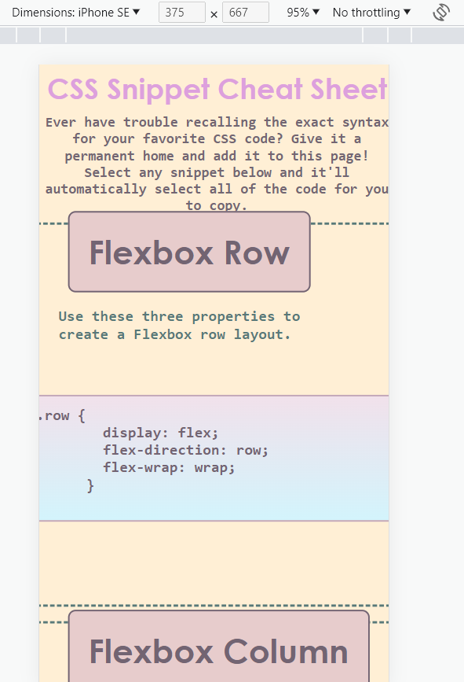
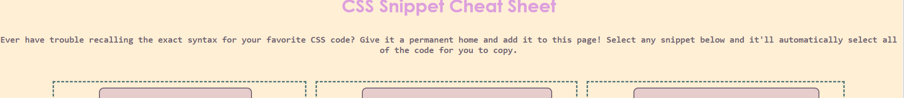

**Title: Mini Project Two
Devoloper: Kai Gurung-Doll
Deployment date: 9/26/23
For: University of Texas Austin Coding Bootcamp
Built with: HTML & CSS**

**This challenge was challenging. The task was as following:**
- Creating six boxes that are in rows.
- The hover feature in each boxes. 
- Gradient on each of the boxes.
- Resizing the page or view screen adapts to viewport. 

**Task that was successful:**

*Six boxes in a row*

*Hover feature and gradient feature in each boxes*

*When minimizing the screen the boxes wraps*

**Task that I still need to work on:**

*When viewed in a small screen the boxes doesn't aligned how I want it to*

*The second header does not align on the center.*

Link: 